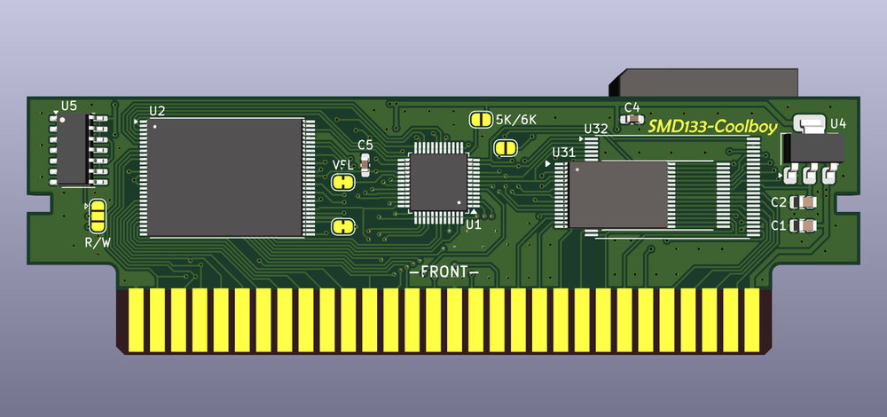

#### COOLBOY - картридж многоигровка для Денди/Famicom

Картридж основан на ASIC **AA6023** в корпусе LQFP-48 с маркировкой **SMD133** и имеет следующие характеристики:
* **PRG ROM**: до 32 МБ
* **CHR RAM**: до 256 КБ
* **PRG RAM**: 8/32 КБ, FRAM или SRAM

Проект создан в [**KiCad 9**](https://www.kicad.org/).

##### Параметры для изготовления PCB
* 2 слоя
* Толщина PCB: 1.2 мм
* Рекомендуется ENIG покрытие контактов краевого разъема

##### Схема
[Schematic PDF](Pics/Coolboy-schematic.pdf)

##### Интерактивный BOM
[BoM](BOM/Coolboy-iBOM.html)

##### Прошивка
Для прошивки картриджа без пайки, перемычка должна соединять среднюю и нижнюю площадки у джампера "R/W". Картридж можно перепрошить с помощью [Famicom/NES Dumper/Writer](https://github.com/ClusterM/famicom-dumper-writer), собрать ROM-файл можно в [COOLBOY Multirom Builder](https://github.com/ClusterM/coolboy-multirom-builder). Спасибо Алексею Кластеру за эти отличные инструменты.

PS Герберы не выкладываю специально - это мой небольшой вклад в популяризацию KiCad :smile:
